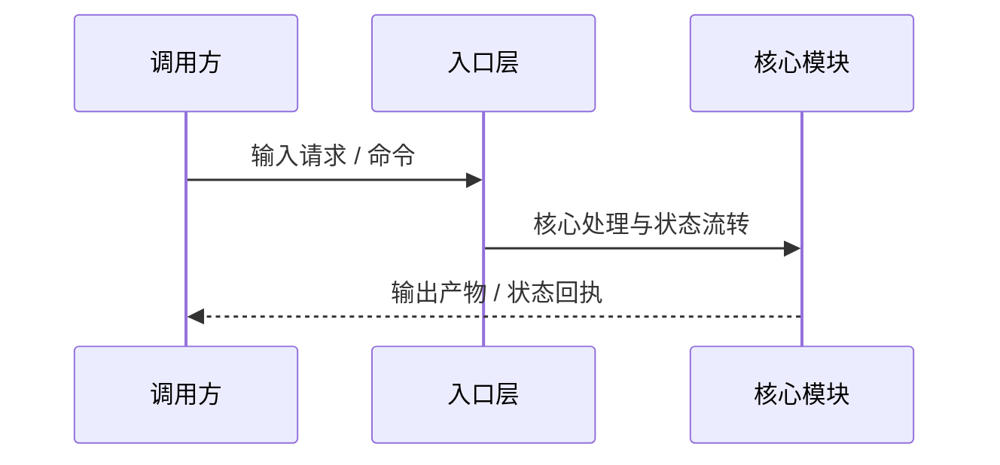

# 核心执行链路与数据流 (Core Data Flow)

> 本文件仅画 1~3 条最核心的端到端主干路径，说明输入进入、阶段转换、副作用发生与落盘/输出位置；不展开边缘分支或单个接口细节。

## 1. 核心主干链路

```mermaid
sequenceDiagram
    participant Caller as 调用方
    participant Entry as 入口层
    participant Core as 核心模块

    Caller->>Entry: 输入请求 / 命令
    Entry->>Core: 核心处理与状态流转
    Core-->>Caller: 输出产物 / 状态回执
```

## 2. 关键副作用与落盘边界

- <!-- 说明主干链路中产生外部写入、持久化或状态变更的关键节点，并链接到真实源码位置 -->
