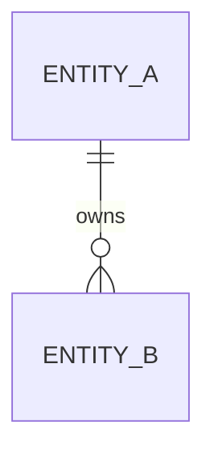
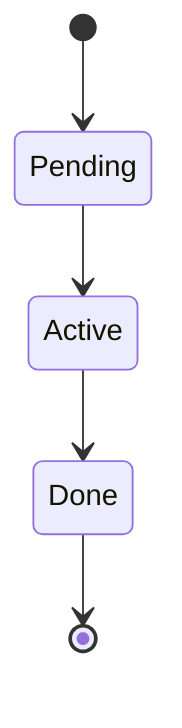

# 核心领域模型与状态机 (Data Model & State)

> 本文件描述核心实体关系、关键对象的生命周期状态流转与权威 Schema/类型定义的源码位置；禁止将结构体字段逐一抄成冗长表格。

## 1. 核心实体关系

```mermaid
erDiagram
    ENTITY_A ||--o{ ENTITY_B : "owns"
```

## 2. 关键生命周期状态机

```mermaid
stateDiagram-v2
    [*] --> Pending
    Pending --> Active
    Active --> Done
    Done --> [*]
```

## 3. 权威 Schema 与类型索引

- <!-- 直接链接到源码中的 Schema、数据模型或配置定义位置 -->
